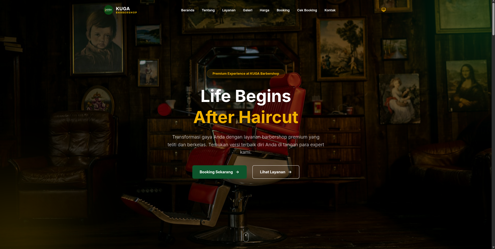
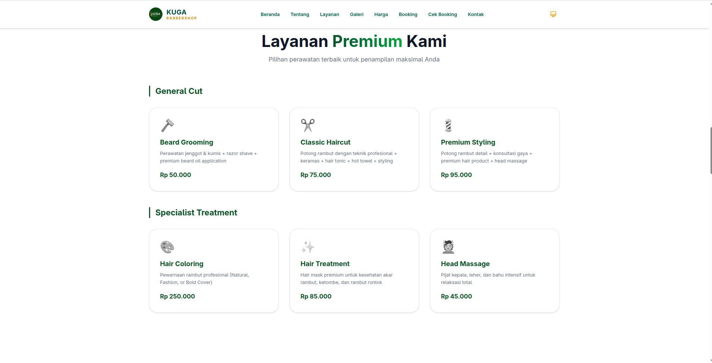
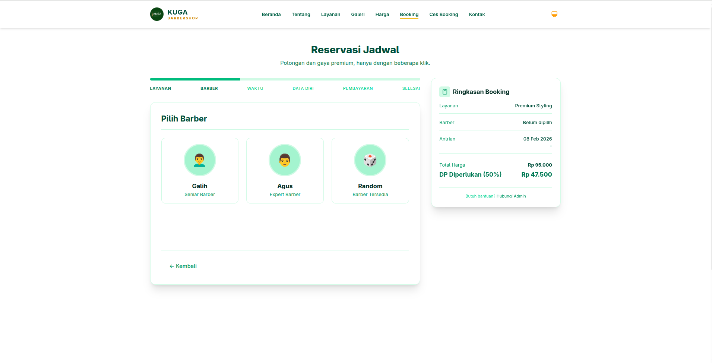
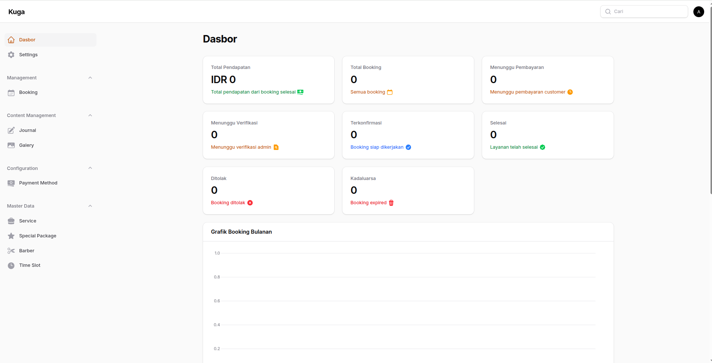
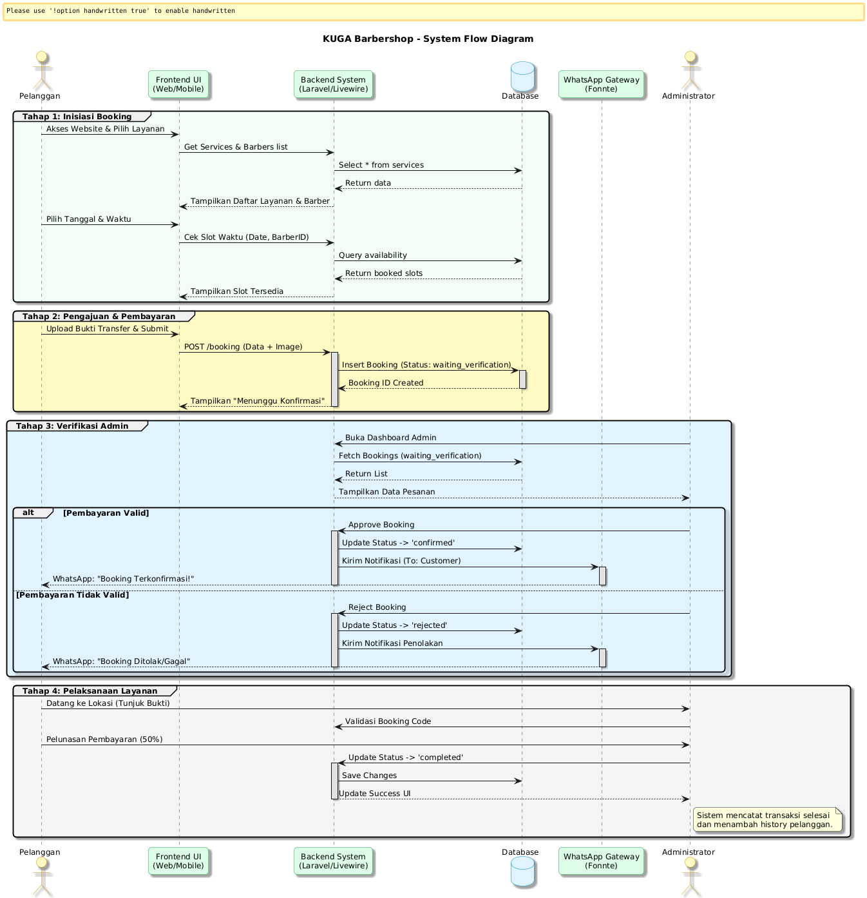

<div align="center">

# 💈 KUGA BARBERSHOP
### *Ganteng Itu Takdir, Rapi Itu Pilihan.*


<br/>

**Sistem Booking Barber yang Nggak Bikin Pusing**  
*Sat-set. Rapi. Kelar.*

[🌐 Cek Barang Aslinya (Live Demo)](https://barber.muslabs.online) · [🐛 Nemuin Bug? Lapor Gih](https://github.com/khoirul-mustofa/barber-kuga/issues) · [☕ Traktir Kopi (Optional)](https://github.com/khoirul-mustofa)

</div>

---

## 🤨 Ini Apaan Sih?

Jujur, **KUGA Barbershop System** ini lahir karena saya gemes sama barbershop yang masih pake kertas lecek buat catet bookingan. Hari gini masih nulis manual? *Hell nah.*

Jadi saya coba kawinin **Laravel 12** yang powernya gila-gilaan sama **TailwindCSS** yang bikin mata adem. Jadilah sistem ini: booking semudah pesen ojol, ngurus admin segampang scroll TikTok.



---

## 🔥 Emang Bisa Ngapain Aja?

Saya bikin ini biar nggak ada lagi drama "Mas, kok nama saya nggak ada di daftar?".

<div align="center">

| 🧢 Buat yang Mau Cukur (Customer) | 👑 Buat yang Punya Lapak (Owner) |
| :--- | :--- |
| **Booking Kilat** - Pilih barber, pilih jam, upload bukti bayar. Beres. | **Dashboard Sultan** - Pantau duit masuk sambil ngopi. |
| **No PHP** - Kalo jadwal penuh ya penuh, sistem nggak bisa dibohongin. | **Atur Pasukan** - Nambah/ngurangin jam kerja barber tinggal klik. |
| **Tampilan Waras** - Buka di HP kentang pun tetep layout-nya bener. | **Laporan Jelas** - Nggak perlu kalkulator lagi buat hitung omzet. |
| **Tiket PDF** - Biar kelihatan resmi dan profesional dikit lah. | **Auto-Notif WA** - Biar jari nggak keriting balesin chat satu-satu. |

</div>

---

## 📸 Nih Buktinya Kalo Nggak Percaya

Biar nggak dikira *no pic = hoax*, nih liat sendiri tampilannya.

### 🏠 Depan Layar (Frontend)
| Halaman Utama | Menu Layanan |
|:---:|:---:|
|  |  |

### ⚙️ Dapur Pacu (Backend)
| Form Booking | Pusat Komando Admin |
|:---:|:---:|
|  |  |

---

## 🧠 Gimana Cara Kerjanya? (Logika di Balik Layar)

Biar temen-temen dev nggak bingung, ini alur bookingnya. Simpel kok, nggak pake ribet.



> **Singkatnya Gini:**
> 1.  Customer pilih mau digantengin siapa & kapan.
> 2.  Upload bukti transfer (wajib, biar nggak kabur).
> 3.  Admin ngecek sambil nyeruput kopi. Klik **Approve**.
> 4.  **BAM!** Notifikasi WA masuk ke HP customer.
> 5.  Customer dateng, potong rambut, bayar sisa, admin seneng.

---

## 🛠️ Senjata yang Dipake (Tech Stack)

Nggak pake framework jadul, kita pake yang *fresh from the oven*:

*   **Laravel 12** - *The OG framework*, solid parah.
*   **FilamentPHP** - *Cheat code* bikin admin panel cakep tanpa pusing mikirin CSS.
*   **TailwindCSS & Blade** - Biar styling ngebut tapi hasil tetep *chef's kiss*.
*   **Livewire** - Bikin web interaktif tanpa harus belajar React/Vue sampe botak.
*   **Database** - MySQL/PostgreSQL, terserah situ punyanya apa.

---

## 🚀 Mau Nyoba di Laptop Sendiri?

Gampang. Asal niat, 5 menit juga kelar.

### 1. Sedot Kodenya
Pastikan udah install **PHP 8.2+**, **Composer**, sama **Node.js** ya. Kalo belum, install dulu sana.

```bash
git clone https://github.com/khoirul-mustofa/barber-kuga.git
cd barber-kuga
```

### 2. Install Bumbu Dapur
```bash
composer install
npm install
```

### 3. Setting Rahasia Negara
```bash
cp .env.example .env
php artisan key:generate
php artisan storage:link
```
_Inget woy: 1. Bikin database dulu & setting `.env`. 2. Command terakhir itu biar gambar bukti bayar bisa muncul, jangan sampe di-skip!_

### 4. Isi Data Bohongan (Dummy)
Biar database nggak kosong melompong kayak hati jomblo.
```bash
php artisan migrate --seed
```

### 5. Gaspol! 🏁
Buka dua terminal biar kayak hacker beneran:
```bash
# Terminal 1 (PHP)
php artisan serve

# Terminal 2 (Frontend)
npm run dev
```

Udah. Buka **[http://localhost:8000](http://localhost:8000)**. Selamat ngoprek! 🎉

---

---

## 💻 Mesin Tempur (Legendary Dev Machine)

Project ini dibuat dengan susah payah di atas laptop **ASUS VivoBook A409FJ** yang kipasnya kadang bunyi kayak helikopter mau take-off. Spesifikasi "Dewa" (Dewa Penolong):

*   **Otak (CPU)**: Intel Core i5-8265U 1.6GHz (Kalo di-boost sampe 3.9GHz langsung demam tinggi).
*   **Mata (GPU)**: NVIDIA GeForce MX230 2GB + Intel UHD 620 (Lumayan buat render... render emosi).
*   **Ingatan (RAM)**: **20GB DDR4** (Hasil oplosan, tapi solid parah).
*   **Gudang Dosa (Storage)**: SSD 512GB (Ngebut) + HDD 512GB (Buat nyimpen *node_modules* yang nggak abis-abis).
*   **Layar**: 14" inch bawaan + **Monitor 24 inch** (Biar kelihatan kayak hacker profesional di film-film).
*   **Nyawa (OS)**: **Fedora 43** (Bleeding edge banget bos, Windows minggir dulu).

*(Laptop ini adalah saksi bisu berapa kali saya `ctrl + z` dan `git reset --hard`)*

---

## 🔐 Akun Admin (Buat Nyoba)

Kalo tadi jalanin seeder, pake akun ini buat login admin. Jangan dipake buat login Facebook ya.

*   🔗 **Login**: [http://localhost:8000/admin](http://localhost:8000/admin)
*   📧 **Email**: `admin@barber.muslabs.online`
*   🔑 **Password**: `password` -> *Password paling kreatif sedunia.*

---

<div align="center">
    
**Project ini dipersembahkan dengan ☕ + 🚬 oleh [Khoirul Mustofa](https://github.com/khoirul-mustofa)**

*(Disusun dengan tetesan keringat, kopi sachet, sebat (banyak), dan bantuan AI yang sabar banget ngadepin prompt saya yang ajaib. Tanpa AI, mungkin *readme* ini isinya cuma "Sistem Booking Barber. Cara pakainya baca sendiri." 💀)*

*Kalo kode ini nyelamatin tugas kuliah atau skripsimu, minimal kasih ⭐ lah ya!*

</div>
